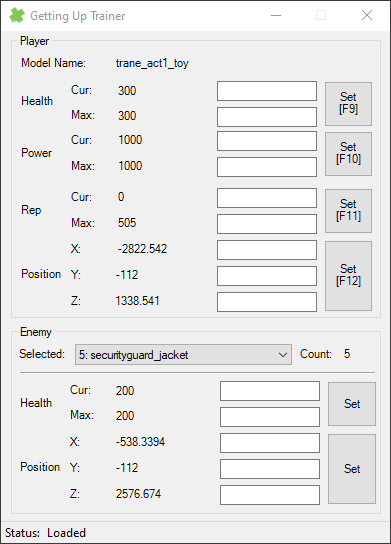

# GettingUpTrainer
Trainer for the game "Marc Eckō's Getting Up: Contents Under Pressure"

The trainer currently can:
* Player
  * View/Edit: Health, Power, Rep, Position (shortuts exist: F9-F12 keys for each one)
* Enemies
  * View/Edit: Health, Position
  
## Preview

## Releases
Version 2.0: [Here](https://github.com/bilakispa/GettingUpTrainer/releases/tag/v2.0)

## Compiling
In order to compile you need:
* MemorySharp (1.2.0)
* SharpDX (4.0.1)
* .NET Framework (4.5)
