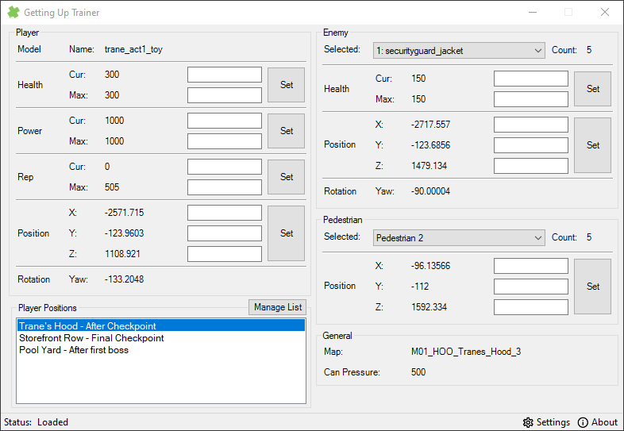
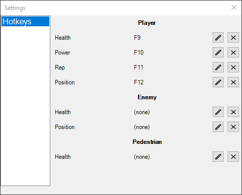

# GettingUpTrainer
Trainer for the game "Marc Ecko's Getting Up: Contents Under Pressure".

Useful for viewing and editing data of various game elements, such as the player, enemies, npcs, and more.
There is also the option to customize hotkeys to edit the data values.
User can also build a custom list of player positions to quickly manage editing the player's position.

## Preview
### Main window

### Settings window

## Releases
Version 2.1: [Here](https://github.com/bilakispa/GettingUpTrainer/releases/tag/v2.1)

## Compiling
In order to compile you need:
* MemorySharp (1.2.0)
* SharpDX (4.0.1)
* .NET Framework (4.5)
